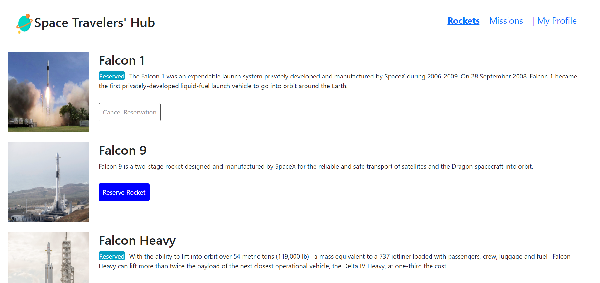
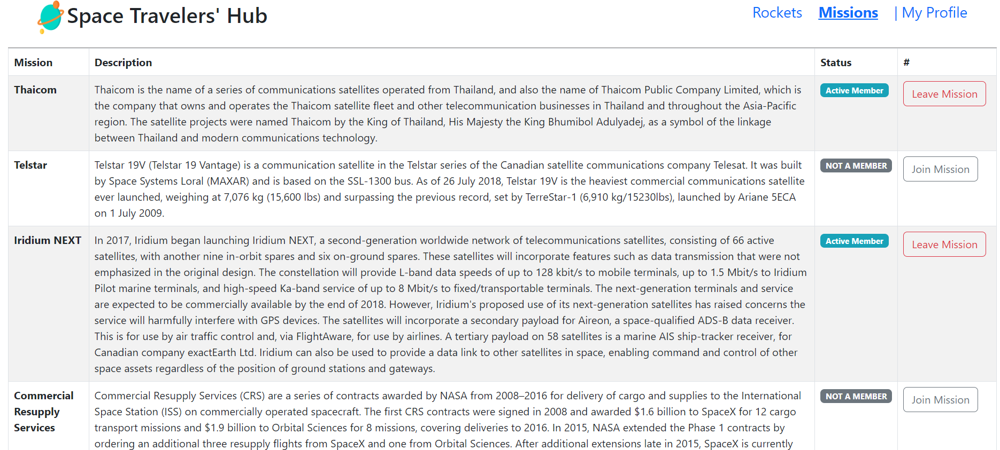
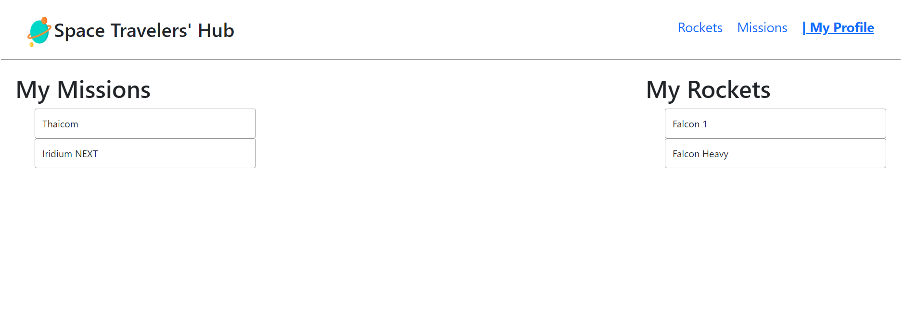

# Space-Travelers-Hub
React group project

 
  <h3><b>Space-Travelers-Hub</b></h3>

# 📗 Table of Contents

- [📖 About the Project](#about-project)
  - [🛠 Built With](#built-with)
    - [Tech Stack](#tech-stack)
    - [Key Features](#key-features)
- [💻 Getting Started](#getting-started)
  - [Setup](#setup)
  - [Prerequisites](#prerequisites)
  - [Install](#install)
  - [Usage](#usage)
  - [Run tests](#run-tests)
  - [Deployment](#triangular_flag_on_post-deployment)
- [👥 Authors](#authors)
- [🔭 Future Features](#future-features)
- [🤝 Contributing](#contributing)
- [⭐️ Show your support](#support)
- [🙏 Acknowledgements](#acknowledgements)
- [❓ FAQ](#faq)
- [📝 License](#license)

# 📖 [Space-Travelers-Hub] 

**[Space-Travelers-Hub]** "Space-Travelers-Hub" is a real live data from the SpaceX API web application for a company that provides commercial and scientific space travel services. The application will allow users to:
- book rockets and,
- join selected space missions.

## 🛠 Built With 
<a name="built-with"> React </a>
<a name="built-with"> Redux </a>
<a name="built-with"> React Bootstrap</a>

### Tech Stack 

  
Client

  <ul>
    <li><a href="https://react.org/">React</a></li>
    <li><a href="https://css.org/">Redux</a></li>
    <li><a href="https://css.org/">React Bootstrap</a></li>
  </ul>

  
Server

  <ul>
    <li>Render</li>
  </ul>

Database

  <ul>
   <li><a href="https://localStorage.com/">Consume APIs</a></li>
  </ul>

### Key Features 

- **[book_rockets]**
- **[cancel_book_rocket]**
- **[join_mission]**
- **[leave_mission]**

(<a href="#readme-top">back to top</a>)

## Screenshots

## Rockets View

## Missions_View

## MyProfile_View

(<a href="#readme-top">back to top</a>)

## 💻 Getting Started 

To get a local copy up and running, follow these steps.

### Prerequisites

In order to run this project you need:

- Have visual studio Code in your PC.
- Have a verified GitHub account.
- Have a stable browser version.

### Setup

- Clone this repository to your desired folder using terminal: 
git clone https://github.com/ReemMohamedAbdelfatah/Space-Travelers-Hub.git

### Install

Install this project with:

- React Redux

### Usage

To run the project, execute the following command:

- npm run build
- npm run start

### Run tests

To run tests, run the following command:

Coming Soon ....

### Deployment

You can deploy this project using:

Coming Soon ....

(<a href="#readme-top">back to top</a>)

## 👥 Authors 

👤 **Reem Muhammed**

- GitHub: [@github](https://github.com/ReemMohamedAbdelfatah)
- LinkedIn: [LinkedIn](https://www.linkedin.com/in/reem-muhammad-a07543116/)

👤 Fahim-Khan

- GitHub: [@github](https://github.com/Fahim-Khan-P/)
- LinkedIn: [LinkedIn](https://www.linkedin.com/in/fahim-khan-38a4b3240/)

(<a href="#readme-top">back to top</a>)

## 🔭 Future Features 

- [ ] **[Better_design]**
- [ ] **[reserve_dragons]**

(<a href="#readme-top">back to top</a>)

## 🤝 Contributing 

Contributions, issues, and feature requests are welcome!

Feel free to check the [issues page](../../issues/).

(<a href="#readme-top">back to top</a>)

## ⭐️ Show your support 

If you like this project please star the project and feel free to add your own touches.

(<a href="#readme-top">back to top</a>)

## 🙏 Acknowledgments 

I would like to thank...

(<a href="#readme-top">back to top</a>)

## ❓ FAQ 

- **[How_to_use_the_app?]**

  - [I puted a small div in the top explaining how to use tha application]

- **[Can_I_Contribute?]**

  - [Sure, you're free to contribute and add your own touches]

(<a href="#readme-top">back to top</a>)

## 📝 License 

This project is [MIT](./LICENSE/MIT.md) licensed.

(<a href="#readme-top">back to top</a>)

